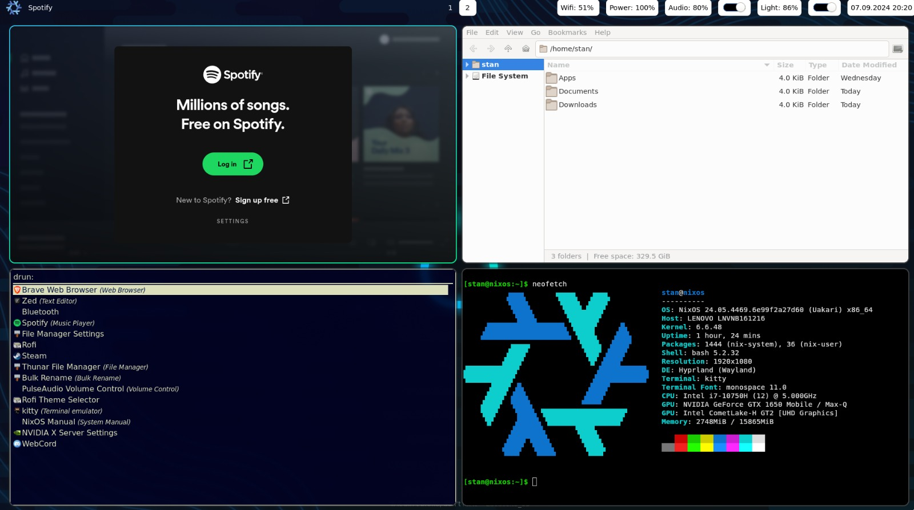

<div align="center"></div>
<h1 align="center">STANIX: NixOS & Hyprland BASE configurations</h1>

# 📖 Read this first
PRs are Welcome! This is `not` a linux rice; this is `base and minimal` NixOS 24.05 + Hyprland configurations
that ensures all `basic functionality` up and running before any Linux Ricing (because beauty is in the eye of the beholder').

I closely followed [Hyprland Wiki](https://wiki.hyprland.org/) for the recommended packages. The basic functionalities are but not limited to:

- Gaming (Steam + Nvidia, see [Wiki](https://wiki.hyprland.org/Nvidia/))
- Running app via GUI launcher ([Rofi](https://github.com/davatorium/rofi))
- File Manager ([Thunar](https://github.com/xfce-mirror/thunar))
- Screenshot ([Grimblast](https://github.com/hyprwm/contrib/tree/main/grimblast))
- Bluetooth ([Blueberry](https://github.com/linuxmint/blueberry))
- Running `.AppImage` files on NixOS ([appimage-run](https://nixos.wiki/wiki/Appimage))
- Text editing ([Zed](https://github.com/zed-industries/zed) - This is personal preference)
- Screen lock ([Hyprlock](https://github.com/hyprwm/hyprlock))
- Wallpaper ([Hyprlock](https://github.com/hyprwm/hyprpaper))
- Sound seting/shortcut (Pulseaudio, Pipewire, Wireplumber - I found NixOS users having initial problem to make it up and running)
- Light setting/shortcut

🚨 Missing/testing:

- Wifi GUI (missing - currently using `$ nmcli device wifi list`)
- Welcome screen (missing)
- Screen reording (missing)
- Microphone input (testing)

## Base UI


## Setup and installation

1. Install NixOS 24.05 ([NixOS](https://nixos.org/) - Choose `No desktop environment`)
2. Install git
3. Open your terminal and run
```
git clone https://github.com/stanley355/stanix.git
cd stanix
cp -r ./configuration.nix /etc/nixos/configuration.nix
cp -r ./.config ~/
nixos-rebuild switch
reboot
```
4. After reboot your Nixos should be up and running
